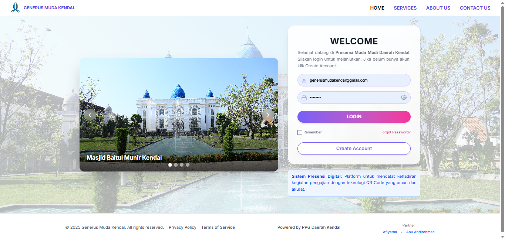
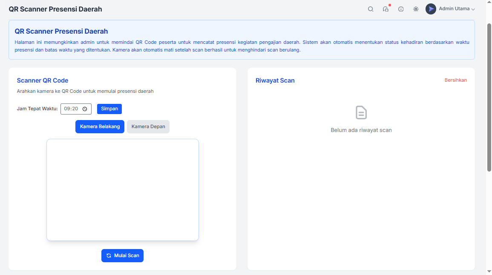
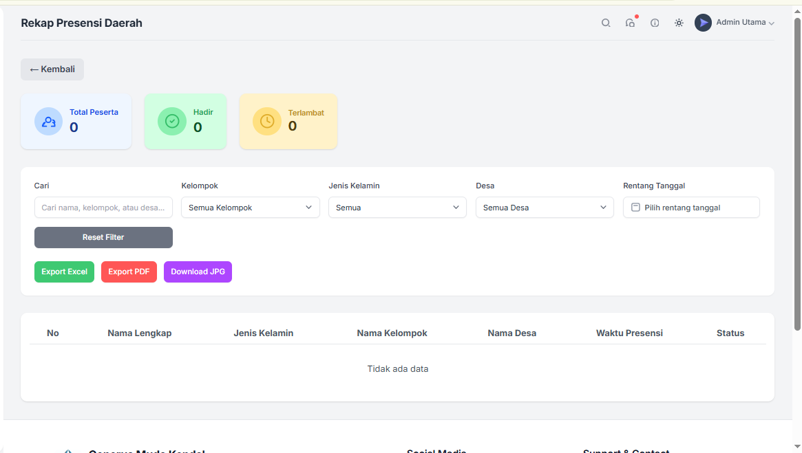
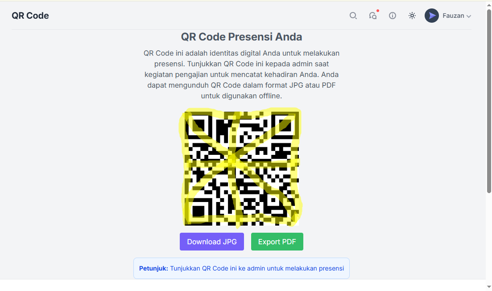

# Sistem Presensi Digital - Presensi Mudamudi



**Sistem Presensi Digital** adalah aplikasi presensi modern yang dibangun dengan React dan Tailwind CSS v4. Aplikasi ini menggunakan teknologi QR Code untuk sistem presensi yang efisien dan terintegrasi dengan Supabase sebagai backend database.

## 🖼️ Preview Aplikasi

### Landing Page & Login

*Halaman utama dengan form login dan carousel gambar Masjid Baitul Munir Kendal*

### QR Scanner Admin

*Interface scanner QR Code untuk admin mencatat presensi peserta*

### Laporan Kehadiran

*Dashboard laporan kehadiran dengan filter dan export data*

### QR Code User

*QR Code personal user untuk presensi dengan opsi download*

## 🚀 Fitur Utama

- **Dashboard Interaktif** - Tampilan data presensi real-time dengan grafik dan statistik
- **QR Code Scanner** - Scanner QR Code untuk presensi masuk dan keluar
- **QR Code Generator** - Generate QR Code personal untuk setiap user
- **Laporan Kehadiran** - Laporan detail kehadiran dengan filter berdasarkan daerah/desa
- **Manajemen User** - Sistem registrasi dan profile management
- **Role-based Access** - Pembedaan akses Admin dan User
- **Responsive Design** - Tampilan optimal di desktop dan mobile
- **Real-time Updates** - Data presensi terupdate secara real-time

## 🛠️ Tech Stack

- **Frontend**: React 19, Vite 6
- **Styling**: Tailwind CSS v4
- **Backend**: Supabase (PostgreSQL + Real-time)
- **QR Code**: html5-qrcode, qrcode.react
- **Charts**: Chart.js 4
- **Routing**: React Router DOM 7
- **UI Components**: Radix UI
- **Notifications**: React Hot Toast

## 📋 Prerequisites

Sebelum menjalankan project ini, pastikan Anda memiliki:

- Node.js (versi 18 atau lebih baru)
- npm atau yarn
- Akun Supabase (untuk database)

## 🚀 Installation & Setup

### 1. Clone Repository
```bash
git clone <repository-url>
cd presensi-mudamudi3
```

### 2. Install Dependencies
```bash
npm install
```

### 3. Setup Supabase
1. Buat project baru di [Supabase](https://supabase.com)
2. Salin URL dan Anon Key dari project Anda
3. Update file `src/supabaseClient.js` dengan kredensial Anda:

```javascript
const supabaseUrl = 'YOUR_SUPABASE_URL';
const supabaseAnonKey = 'YOUR_SUPABASE_ANON_KEY';
```

### 4. Setup Database Schema
Jalankan query SQL berikut di Supabase SQL Editor:

```sql
-- Buat tabel users
CREATE TABLE users (
  id UUID DEFAULT gen_random_uuid() PRIMARY KEY,
  email VARCHAR UNIQUE NOT NULL,
  full_name VARCHAR NOT NULL,
  role VARCHAR DEFAULT 'user',
  created_at TIMESTAMP DEFAULT NOW()
);

-- Buat tabel attendance
CREATE TABLE attendance (
  id UUID DEFAULT gen_random_uuid() PRIMARY KEY,
  user_id UUID REFERENCES users(id),
  check_in TIMESTAMP,
  check_out TIMESTAMP,
  location VARCHAR,
  created_at TIMESTAMP DEFAULT NOW()
);
```

## 🏃‍♂️ Running the Application

### Development Mode
```bash
npm run dev
```
Aplikasi akan berjalan di `http://localhost:5173`

### Production Build
```bash
npm run build
```

### Preview Production Build
```bash
npm run preview
```

## 📱 Fitur Aplikasi

### 👤 User Features
- **Dashboard Personal** - Melihat statistik presensi pribadi
- **QR Code Personal** - Generate dan tampilkan QR Code untuk presensi
- **Riwayat Presensi** - Melihat history presensi pribadi
- **Profile Management** - Update informasi profile

### 👨‍💼 Admin Features
- **QR Scanner** - Scan QR Code untuk presensi user
- **Laporan Kehadiran** - Generate laporan kehadiran berdasarkan daerah/desa
- **Data Profile User** - Kelola data semua user
- **Dashboard Admin** - Overview sistem secara keseluruhan

## 🗂️ Project Structure

```
src/
├── components/          # Reusable components
├── pages/              # Page components
│   ├── Dashboard.jsx
│   ├── QrScannerMenu.jsx
│   ├── UserQRCode.jsx
│   ├── UserPresensiHistory.jsx
│   └── ...
├── layouts/            # Layout components
├── charts/             # Chart configurations
├── hooks/              # Custom React hooks
├── utils/              # Utility functions
├── css/                # Stylesheets
├── supabaseClient.js   # Supabase configuration
└── App.jsx             # Main app component
```

## 🔧 Configuration

### Environment Variables
Buat file `.env` di root project:

```env
VITE_SUPABASE_URL=your_supabase_url
VITE_SUPABASE_ANON_KEY=your_supabase_anon_key
```

### Tailwind Configuration
Project menggunakan Tailwind CSS v4 dengan konfigurasi custom di `tailwind.config.js`.

## 📊 Database Schema

### Users Table
- `id` - UUID Primary Key
- `email` - Email user (unique)
- `full_name` - Nama lengkap
- `role` - Role user (admin/user)
- `created_at` - Timestamp pembuatan

### Attendance Table
- `id` - UUID Primary Key
- `user_id` - Foreign key ke users
- `check_in` - Waktu check-in
- `check_out` - Waktu check-out
- `location` - Lokasi presensi
- `created_at` - Timestamp pembuatan

## 🚀 Deployment

### Vercel (Recommended)
1. Push code ke GitHub
2. Connect repository ke Vercel
3. Set environment variables di Vercel dashboard
4. Deploy

### Netlify
1. Build project: `npm run build`
2. Upload folder `dist` ke Netlify
3. Set environment variables

## 🤝 Contributing

1. Fork project
2. Buat feature branch (`git checkout -b feature/AmazingFeature`)
3. Commit changes (`git commit -m 'Add some AmazingFeature'`)
4. Push ke branch (`git push origin feature/AmazingFeature`)
5. Buat Pull Request

## 📝 License

Project ini menggunakan license GPL v3.0. Lihat file `LICENSE` untuk detail lebih lanjut.

## 🆘 Support

Jika Anda mengalami masalah atau memiliki pertanyaan:

1. Cek [Issues](../../issues) untuk solusi yang sudah ada
2. Buat issue baru jika masalah belum ada
3. Hubungi tim development untuk bantuan lebih lanjut

## 🔄 Changelog

Lihat [CHANGELOG.md](CHANGELOG.md) untuk melihat history perubahan project.

---

**Dibuat dengan ❤️ untuk sistem presensi digital yang lebih efisien**